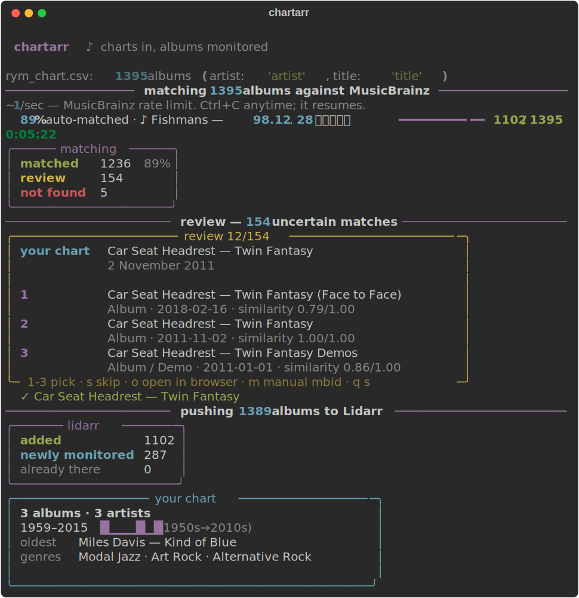

# chartarr ♪

**Feed your album charts to Lidarr.**

You have a CSV of albums — a RateYourMusic chart export, a best-of list, your
own spreadsheet. Lidarr only speaks MusicBrainz IDs. chartarr bridges the gap:

```
match (MusicBrainz)  →  review (you, 30 seconds)  →  push (Lidarr)
```



## Install

```bash
pipx install chartarr        # or: pip install chartarr
```

## Use

```bash
chartarr mychart.csv
```

That's the whole thing. chartarr will:

1. **Match** every `artist + title` row against MusicBrainz release groups
   (~1/sec — their rate limit, not ours). On a real 1,395-album RYM chart,
   **88.6% matched automatically**, including nightmares like `★ [Blackstar]`,
   `F♯A♯∞`, and dual-script Japanese titles.
2. **Review** the uncertain ones in a little TUI — your row on top, the best
   MusicBrainz candidates below. Press `1`–`3` to pick, `s` to skip, `o` to
   open the candidate in your browser, `m` to paste an MBID by hand.
3. **Push** everything to Lidarr as **monitored albums**, with each artist set
   to *monitor: none* — you get your list, not 600 entire discographies.

First run asks for your Lidarr URL + API key (Settings → General → Security)
and stores them in `~/.config/chartarr/config.json`. Env vars
`LIDARR_URL` / `LIDARR_API_KEY` override.

### Flags you'll actually use

| flag | effect |
|---|---|
| `--dry-run` | show what would be pushed, touch nothing |
| `--yes` | skip the review step, push confident matches only |
| `--search` | tell Lidarr to start searching for the added albums |
| `--match-only` / `--review-only` / `--push-only` | run one stage |
| `--quality-profile` / `--metadata-profile` / `--root-folder` | override Lidarr defaults (first of each is used otherwise) |

Everything is resumable: progress streams to `<your>.csv.chartarr.jsonl`, so
Ctrl+C whenever — rerunning the same command picks up where it stopped. Pushes
are idempotent too: albums already in Lidarr are skipped, and albums Lidarr
already knows about but wasn't monitoring get flipped to monitored.

## CSV format

Any CSV with an artist column (`artist`, `artist_name`, …) and a title column
(`title`, `album`, `release`, …). Extra columns are fine — if `release_date`
and `genres` exist (RYM exports have both), you get a nicer stats panel at the
end. See [`examples/sample.csv`](examples/sample.csv).

## Good-citizen notes

- **MusicBrainz**: chartarr paces itself to ~1 request/second and sends a
  descriptive User-Agent, per their [API rules](https://musicbrainz.org/doc/MusicBrainz_API/Rate_Limiting).
  Don't run several copies in parallel from one IP.
- **Lidarr**: an "album" in Lidarr is a MusicBrainz *release group* — exactly
  what chartarr matches. Note that Lidarr's built-in Custom List import only
  handles whole *artists*; that's why chartarr talks to the API instead.

## Why not just import the CSV into Lidarr?

Because Lidarr has no CSV import — no file import of any kind. Its bulk
entry points are import lists (artist-level only) and the HTTP API. chartarr
is the missing piece: the tedious name→MBID matching, plus a human-in-the-loop
for the genuinely ambiguous cases (two release groups named *Twin Fantasy*,
"Mingus" vs "Charles Mingus", the *When the Pawn…* 90-word title).

## License

[MIT](LICENSE)
