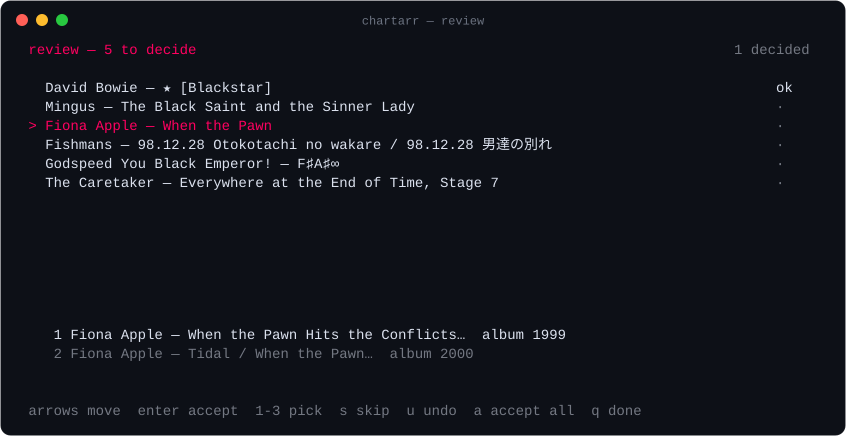
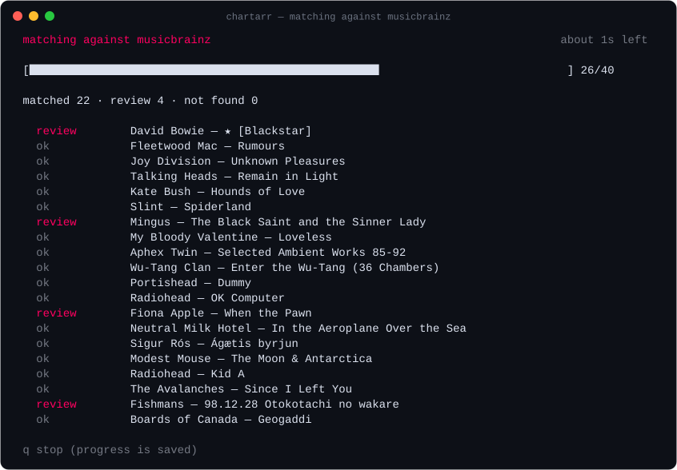
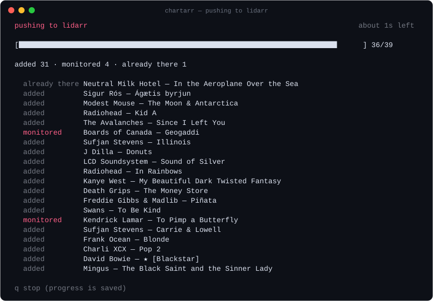

# chartarr

Feed a CSV of albums to Lidarr.

chartarr matches each artist/title pair against MusicBrainz and adds the
results to Lidarr as monitored albums. Anything it isn't sure about gets
a review screen. Only the albums in the CSV are monitored, not each
artist's full discography.

Lidarr has no album import of its own. The import lists it does have
take artists, and adding an artist pulls in everything they ever
released, which is rarely what a chart wants. So chartarr adds the
artist with just your albums marked to monitor. The rest stays
unmonitored.

## Install

    pipx install git+https://github.com/alperien/chartarr

or with [uv](https://docs.astral.sh/uv/):

    uv tool install git+https://github.com/alperien/chartarr

Needs Python 3.10 or later. Windows installs windows-curses
automatically. Not on PyPI yet.

## Use

    chartarr chart.csv

Matching runs first. MusicBrainz allows one request per second and a
row usually takes two or three, so 200 rows take about ten minutes.
Progress is saved to `<csv>.chartarr.jsonl` after every row. Press q to
stop; the next run continues where this one left off.

Uncertain rows go to review. Enter accepts the suggestion, 1-3 pick
another candidate, s skips, u undoes, a accepts everything left, q
finishes. Decisions are saved immediately.

The push skips albums Lidarr already has and monitors ones it knows but
wasn't monitoring, so rerunning a chart is safe. Monitoring does not
download anything by itself: pass `--search` to start the downloads, or
chartarr will tell you how many albums are waiting.

The last line of a run sums up the chart:

    39 albums, 36 artists · 1959–2017 ▂▄▄▂█▆▇ · mostly art rock

Piped output prints plain lines instead of the screens. Rows that need
review are held until there is a terminal, or `--yes` pushes without
them.

`chartarr --example` writes a sample CSV to try things on. `chartarr
--demo` plays through a whole run on fake data; nothing is saved or
sent.

## Options

    --dry-run           show what would be pushed without changing anything
    --yes               skip the review stage
    --search            have Lidarr look for the albums and download them
    --match-only        run only the match stage
    --review-only       run only the review stage
    --push-only         run only the push stage
    --example           write sample.csv to the current directory
    --demo              simulate a full run with sample data
    --quality-profile   Lidarr quality profile (default: first)
    --metadata-profile  Lidarr metadata profile (default: first)
    --root-folder       Lidarr root folder (default: first)
    --state             state file path (default: <csv>.chartarr.jsonl)
    --rematch           look up rows nothing was found for again
    --setup             set the Lidarr URL and API key

## The CSV

Needs an artist column (`artist`, `artists`, `artist_name`,
`albumartist`, `album artist`) and a title column (`title`, `album`,
`album_title`, `release`, `name`). Other columns are ignored, apart from
`release_date` and `genres`, which feed the summary line. A
RateYourMusic export works unchanged; that's the file this was written
for in the first place.

Rows are keyed by artist and title, not position, so the CSV can be
edited and reordered between runs without losing any matches.

## Configuration

The first run asks for the Lidarr URL and API key (Settings > General >
Security) and writes them to `~/.config/chartarr/config.json`, readable
only by you. `LIDARR_URL` and `LIDARR_API_KEY` override the file, as do
`CHARTARR_LIDARR_URL` and `CHARTARR_API_KEY` if those names are taken.
`chartarr --setup` changes the saved values.

## Notes

- A Lidarr album is a MusicBrainz release group. That is what gets
  matched.
- When a live album or compilation has the same title as the studio
  record, the row goes to review instead of being guessed. A title that
  names the live version ("Live at the Apollo") matches it directly.
- One request per second is the MusicBrainz rate limit, so don't run two
  copies at once.

## License

MIT
